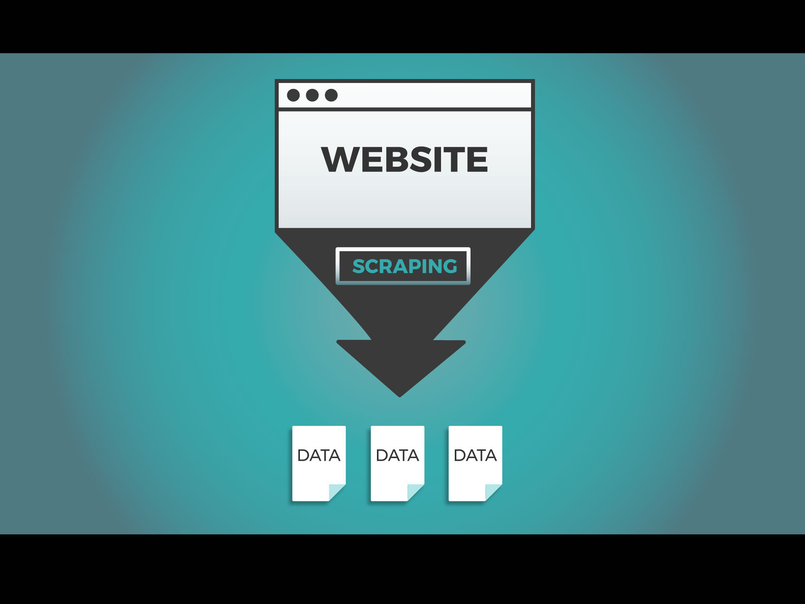

# NTU OSS Data scraping and Data cleaning workshop


_This repositry contains the reference scripts and content presented in the NTU OSS Data scraping and Data cleaning workshop._

**Presenter:** <ins>Siddesh</ins> Sambasivam Suseela <br>
**Date (Time):** 18 September 2020 (6:30 PM - 8:30 PM SGT)

## Hello There!

In this workshop we'll be mining data from web to create our own datasets for two of the most popular task in machine learning. Firstly, we'll be looking into mining different types of data from web and then we'll move to data cleaning.

<div style="text-align:center">
<a href="http://www.youtube.com/watch?v=Ct8Gxo8StBU"> 

</a></div>

**GOAL**

- [x] This is a complete item
- [ ] This is an incomplete item
- [ ] fasd

To give some context before

- What are different types of data?
- How does noisy data look like?
- Why do we need to clean data?
- Web Scraping vs Web crawling

- Beatiful Soup vs Selenium vs Scrapy

  Selenium and Beautifulsoup are very easy to learn and are suitable if you are trying to mine a small of amount of data from the web and on the downside, you might get blocked in some websites which require Captcha.

  On the other hand, Scrapy has a much steeper learning curve but it is much more robust and very efficient compared to others. It is very much advised to use Scrapy when mining much larger data from the web.

<br><br><br><br>

# TASK 0: Set up the environment

**For Unix systems (macOS & Linux)**

1. Firstly, we need to installing pip (skip this step if already installed).

   ```bash
   $ python3 -m pip install --user --upgrade pip
   $ python3 -m pip --version
   ```

2. Secondly, we need to install virtuaenv

   ```bash
   $ python3 -m pip install --user virtualenv
   ```

3. We need to create a virtual environment for our project and actiavte the environment. This allows us to avoid any kind of potential dependecies related problems.

   ```bash
   $ python3 -m venv tgifhacks
   $ source tgifhacks/bin/activate
   ```

   To leave the enviroment use `deactivate` command.

4. Finally, we install the required packages for the workshop.

   ```bash
   $ pip install -r requirements.txt
   ```

**For Windows Systems**

1. Firstly, lets install virtuaenv.

   ```bash
   $ py -m pip install --user virtualenv
   ```

2. We need to create a virtual environment for our project and actiavte the environment. This allows us to avoid any kind of potential dependecies related problems.

   ```bash
   $ py -m venv tgifhacks
   $ .\tgifhacks\Scripts\activate
   ```

   To leave the enviroment use `deactivate` command.

3. Finally, we install the required packages for the workshop.

   ```bash
   $ pip install -r requirements.txt
   ```

<br>

# TASK 1: Introduction to Scrapy and XPath

> **Writer's Note:**
>
> - What is scrapy?
> - what is xpath and how to use xpath to select the content in a web page?
> - Introduction using scrapy shell and two examples

**Scrapy** is a very efficient and powerful framework to crawl websites and extract structured data which can be used for a wide range of useful applications, like data mining and information processing [1].

Scrapy uses a `spider` to crawl through websites. A `Spider` is a search engine bot that downloads and indexes content from the urls provided by the programmer.

In order for us to scrape useful data from webpages we have to tell the `spider` which elements need to be scraped from a web page and thats done in the following two ways :

1.  CSS Selectors
2.  XPath _(In this workshop, we'll only focus on XPath)_

## so what exactly is xpath?

`XPath`, the XML path language, is a query language for selecting nodes from an XML document. Locating elements with XPath works very well with a lot of flexibility.

XPath uses path expressions to navigate through elements and attributes in an XML document. Lets look into an example to understand what exactly is xpath and its usage.

```html
<html>
  <head>
    <title> My Page </title>
  </head>
  <body>
    <div class="container">
      <p class="para 1">
        <a href="#" >TGIF Hacks
      </p>
      <p class="para 2">
        
      </p>
    </div>
  </body>
</html>
```

<div style="text-align:center"></div>

<br><br><br><br>

# TASK 2: Create an image classification dataset

Great! Now that we know the basic usage of scrapy, let's get started to scrape some data to create our first dataset.

We'll be taking a more systematic approach as with that you could easily replicate the same steps to create your own datasets.

**<h3>Step 1: </h3>**
We need to create a scrapy project directory and luckily scrapy provide us with some boilerplate code.

```bash
$ scrapy startproject imgClfDataset
$ cd imgClfDataset
```

Then We create a python script with which we'll code in the set instructions for our spider.

```bash
$ touch ./imgClfDataset/spiders/images.py
```

**<h3>Step 2: </h3>**
The following is the content for the `images.py` script.

```python
# images.py

import scrapy
from RawData.items import  Rawdataitem
from scrapy.loader import ItemLoader

class images(scrapy.Spider):

    name = "raw_paint"
    start_urls = [
    "https://fineartamerica.com/art/photographs"
    ]
    page = 1

    def parse(self, response):
        title = response.xpath('________').extract() # Fill the xpath for titles
        urls  = response.xpath('________').extract() # Fill the xpath for images url
        self.page= self.page + 1
        for url, name in zip(urls, title):
            yield Rawdataitem(file_urls = [url], title= name)

        next_page = f'https://fineartamerica.com/art/photographs?page={self.page}'
        yield scrapy.Request(next_page, self.parse)
```

To save the requested images from the url, we have to add a line in the `settings.py` script to specify the download location.

```python
# settings.py

FILES_STORE = '../scraped_data/' # Add this line and also create the folder

```

**<h3>Step 3: </h3>**

<br><br><br><br>

# TASK 3: News Headlines Dataset

<br><br><br><br>

# Supplementary Materials

Thanks for attend the workshop! I hope it gave you a better idea about scraping data from web. I thought maybe I could provide some study materials for reference or if you wish to explore more about this topic.

## Massive open online course

1. **Mining Massive Datasets:** The courses is quite an advanced course but the contents covered are really interesting. They have a youtube playlist along with a reference book.

   - https://www.youtube.com/channel/UC_Oao2FYkLAUlUVkBfze4jg/videos
   - https://www.youtube.com/channel/UC_Oao2FYkLAUlUVkBfze4jg/videos
   - http://www.mmds.org/

2.

## Some Project Ideas to explore

1. Try to scrape some data from

### References

1. https://docs.scrapy.org/en/latest/intro/overview.html
2. https://packaging.python.org/guides/installing-using-pip-and-virtual-environments/
