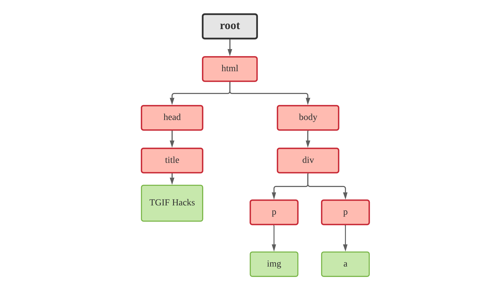

# **NTU OSS Data scraping and Data cleaning workshop**


> _This repositry contains the reference scripts and the content presented in the NTU OSS Data scraping and Data cleaning workshop._

**Presenter:** <ins>Siddesh</ins> Sambasivam Suseela <br>
**Date (Time):** 25 September 2020 (6:30 PM - 8:30 PM SGT)

## **Hello There!**

In this age of data-driven world, scraping and crawling content from the web to create datasets is a crucial skill to have in your portfolio. This workshop aims to give attendees a brief introduction into data scraping from web pages to cleaning the scraped data. By the end of the workshop, attendees should have acquired some hands-on experience with the topic by creating their very own datasets.

In this workshop, attendees will learn about the entire data preparation and collection stage in a machine learning pipeline. We’ll be using scrapy (a python web-crawling framework) to scrape content from webpages and use various python libraries to preprocess our data. By the end of the workshop, the attendees will create a news headlines dataset for sentiment analysis task and Paintings Vs Photographs dataset for binary image classification dataset.

<br>

Before we start to scrape some data from web, its always useful to know the type of data thats needed for the task at hand. The following section introduces the basic classification of data and its relevance to different tasks, in addition we'll look into a few questions which would give you a sense of clarity about the topics thats dicussed in the workshop. I would advise everyone to just take a look into it but if you feel comfortable you can just skip the section.

<br/>

## **Let's get some context!**

<p align="center">
  
</p>

Data is the raw form of information that we absorb in a day-to-day basis, it ranges from being an observation to creation such as a news headlines to movies.

In the scope of data science, there are various ways in which data could be classified but the most simplest way is to classify them in the following way [3]:

1.  Structured Data

    1.1 Numerical Data

    1.2 Categorical Data

    1.3 Timeseries Data

    1.4 Mixed Data

2.  Unstructured Data

    2.1 Image Data

    2.2 Text Data

    2.3 Video Data

Depending on the task, the type of data used could vary widely among the above mentioned.In this workshop, we are focused on scraping **text and image data** from web pages for the mentioned tasks. Read more about it from this [link](https://towardsdatascience.com/7-data-types-a-better-way-to-think-about-data-types-for-machine-learning-939fae99a689).

Look into the FAQs for more questions related to the topic. Now, lets start with the first task.
<br/>

# TASK 0: Set up the environment

**For Unix systems (macOS & Linux)**

1. Firstly, we need to installing pip (skip this step if already installed).

   ```bash
   $ python3 -m pip install --user --upgrade pip
   $ python3 -m pip --version
   ```

2. Secondly, we need to install virtuaenv

   ```bash
   $ python3 -m pip install --user virtualenv
   ```

3. We need to create a virtual environment for our project and actiavte the environment. This allows us to avoid any kind of potential dependecies related problems.

   ```bash
   $ python3 -m venv tgifhacks
   $ source tgifhacks/bin/activate
   ```

   To leave the enviroment use `deactivate` command.

4. Finally, we install the required packages for the workshop.

   ```bash
   $ pip install -r requirements.txt
   ```

**For Windows Systems**

1. Firstly, lets install virtuaenv.

   ```bash
   $ py -m pip install --user virtualenv
   ```

2. We need to create a virtual environment for our project and actiavte the environment. This allows us to avoid any kind of potential dependecies related problems.

   ```bash
   $ py -m venv tgifhacks
   $ .\tgifhacks\Scripts\activate
   ```

   To leave the enviroment use `deactivate` command.

3. Finally, we install the required packages for the workshop.

   ```bash
   $ pip install -r requirements.txt
   ```

<br>

# TASK 1: Introduction to Scrapy and XPath

<p align="center">
  
</p>

**Scrapy** is a very efficient and powerful framework to crawl websites and extract structured data which can be used for a wide range of useful applications, like data mining and information processing [1].

Scrapy uses a `spider` to crawl through websites. A `Spider` is a search engine bot that downloads and indexes content from the urls provided by the programmer.

In order for us to scrape useful data from webpages we have to tell the `spider` which elements need to be scraped from a web page and thats done in the following two ways :

1.  CSS Selectors
2.  XPath _(In this workshop, we'll only focus on XPath)_

## so what exactly is xpath?

`XPath`, the XML path language, is a query language for selecting nodes from a XML or HTML document. Locating elements with XPath works very well with a lot of flexibility.

XPath uses path expressions to navigate through elements and attributes in an XML document. Lets look into an example to understand what exactly is xpath and its usage.

```html
<html>
  <head>
    <title> My Page </title>
  </head>
  <body>
    <div class="container">
      <p class="para 1">
        <a href="#" >TGIF Hacks
      </p>
      <p class="para 2">
        
      </p>
    </div>
  </body>
</html>
```

The above html file can be represented in the below tree structure with each elements in the same level are called siblings and the elements below the level are called children.

<div style="text-align:center"></div>

Usually to access any element, we could either state the absolute path like `html/head/body/title` or use `//` to select the element like `//title`. `//` is starts from the root and fetches all the elements with name `title`.

The following are the few ways you could use to access each element

- To access the img link in the html file

  > `"//div[@class='containers']/p[@class='para 1']/img/@src"` or
  > `"//p[@class='para 2']/img/@src"`

  `@` could be used to access the attributes of a element and `[]` is used to index the element as its necessary when there is multiple instances of the same tag. `[]` uses the attributes (which can be accessed using `@`) to uniquely identify an element.

- To access the `<a>` tag

  > `"//p[@class='para 1']/a/@href"`

  This gets the hyperlink attached to the `<a>` tag.

> _**NOTE:** Make sure to **not to use** the same set of quotes to enclose the paths._
>
> Example:
>
> `"//p[class="para 1"]"` or `'//p[class='para 1']'`

<br>

### **Scrapy Shell (Debugger)**

Now that we learned to access the elements, lets try to actually apply it. Its always a best practice to try out the xpath in the scrapy shell to check if the xpath works, this helps us avoid unnecessary headache in the later stage of our project.

**Step 1:** Open the terminal and activate the environment and enter the following in the terminal to open scrapy shell.

```bash
$ scrapy shell
```


**Step 2:** `fetch([URL])` will get the response from the URL provided and will store in the variable `response`. And you can view the response using `view()`.


**Step 3:** To get an element from the page, we use `response.xpath([PATH]).extract()`. In this case, we get the list of the portal.


Now that we are quite comfortable with the extracting data from the html files, lets start to create our first dataset.

<br>

# TASK 2: Create an image classification dataset

<p align="center">
  
</p>

Great! Now that we know the basic usage of scrapy, let's get started to scrape some data to create our first dataset.

We'll be taking a more systematic approach as with that you could easily replicate the same steps to create your own datasets.

**<h3>Step 1: </h3>**
We need to create a scrapy project directory and luckily scrapy provide us with some boilerplate code.

```bash
$ scrapy startproject imgClfDataset
$ cd imgClfDataset
```

Then We create a python script with which we'll code in the set instructions for our spider.

```bash
$ touch ./imgClfDataset/spiders/images.py
```

**<h3>Step 2: </h3>**
Next we need to create a scrapy field which acts as a placeholder for the scraped data. Go to the `items.py` file (create the file if its not created by default)

```python
# items.py

import scrapy


class ImgclfdatasetItem(scrapy.Item):

    image_titles = scrapy.Field()
    images = scrapy.Field()
    image_urls = scrapy.Field()

```

**<h3>Step 3: </h3>**
Finally we use the all that we learned before to instruct the spider to crawl the data we need. We set the `name` of our spider and other parameters such as maximum page limit in the `page_limit`.

Firstly, we'll scrape the images of `photographs` after which you can change the `classname` variable to `paintings`.

The following is the content for the `images.py` script.

```python
# images.py

import scrapy
from scrapy.loader import ItemLoader
from ..items import ImgclfdatasetItem

class images(scrapy.Spider):

    name = 'images'
    classname = "photographs" # [ "photographs", "paintings"]
    start_urls = [
        f"https://fineartamerica.com/art/{classname}"
    ]
    page = 1
    image_urls = []
    image_titles = []
    page_limit = 10

    def parse(self, response):

        self.image_titles = response.xpath('//p[@class="flowArtworkName"]//text()').extract()
        self.image_urls  = response.xpath('//div[@class="flowImageContainerDiv"]/a/img/@data-src').extract()

        self.page= self.page + 1

        if self.page <= self.page_limit:
            item = ImgclfdatasetItem()
            item['image_urls'] = self.image_urls
            item['image_titles'] = self.image_titles
            yield item

            next_page = f'https://fineartamerica.com/art/{self.classname}?page={self.page}'
            yield scrapy.Request(next_page, callback=self.parse)

```

To save the requested images from the url, we have to add a line in the `settings.py` script to specify the download location.

```python
# settings.py
ITEM_PIPELINES = {'scrapy.pipelines.images.ImagesPipeline': 1}

IMAGES_STORE = '/Users/siddesh.suseela/Work/ntuoss-dataScrapingAndDataCleaning/imgClfDataset/raw_dataset/paintings' # Add this line and also create the folder

```

**<h3>Step 3: </h3>** Change the directory to the root folder which contains the `scrapy.cfg` and enter the following command in the terminal to instruct your spider to start crawling through the pages and scraping the content from the web page.

```bash
$ scrapy crawl images
```

<br/>

## **Scrapy Architecture**


### **Components**

**Scrapy Engine**
The engine is responsible for controlling the data flow between all components of the system, and triggering events when certain actions occur. See the Data Flow section above for more details.

**Scheduler**
The Scheduler receives requests from the engine and enqueues them for feeding them later (also to the engine) when the engine requests them.

**Downloader**
The Downloader is responsible for fetching web pages and feeding them to the engine which, in turn, feeds them to the spiders.

**Spiders**
Spiders are custom classes written by Scrapy users to parse responses and extract items from them or additional requests to follow. For more information see Spiders.

**Item Pipeline**
The Item Pipeline is responsible for processing the items once they have been extracted (or scraped) by the spiders. Typical tasks include cleansing, validation and persistence (like storing the item in a database).

**Downloader middlewares**
Downloader middlewares are specific hooks that sit between the Engine and the Downloader and process requests when they pass from the Engine to the Downloader, and responses that pass from Downloader to the Engine.

**Spider middlewares**
Spider middlewares are specific hooks that sit between the Engine and the Spiders and are able to process spider input (responses) and output (items and requests).

<br/>

# TASK 3: News Headlines Dataset

<br><br><br><br>

# Supplementary Materials

Thanks for attending the workshop! I hope it gave you a better idea about scraping data from web. These are a few study materials for reference or if you wish to explore more about this topic.

## **Massive open online course (MOOC)**

1. **Mining Massive Datasets:** The courses is quite an advanced course but the contents covered are really interesting. They have a youtube playlist along with a reference book.

   - https://www.youtube.com/channel/UC_Oao2FYkLAUlUVkBfze4jg/videos
   - https://www.youtube.com/channel/UC_Oao2FYkLAUlUVkBfze4jg/videos
   - http://www.mmds.org/

2.

## **Some Project Ideas to explore**

1. Try to scrape some data from

### **FAQs for the workshop**

To give some context before

- What are different types of data?
- How does noisy data look like?
- Why do we need to clean data?
- Web Scraping vs Web crawling

- Beatiful Soup vs Selenium vs Scrapy

  Selenium and Beautifulsoup are very easy to learn and are suitable if you are trying to mine a small of amount of data from the web and on the downside, you might get blocked in some websites which require Captcha.

  On the other hand, Scrapy has a much steeper learning curve but it is much more robust and very efficient compared to others. It is very much advised to use Scrapy when mining much larger data from the web.

### **References**

1. https://docs.scrapy.org/en/latest/intro/overview.html
2. https://packaging.python.org/guides/installing-using-pip-and-virtual-environments/
3. Lecture Slides, Introduction to Data Science and Artificial Intelligence, Prof. Sourav Sen, NTU.
4. https://docs.scrapy.org/en/latest/topics/architecture.html#:~:text=also%20described%20below.-,Data%20flow,to%20crawl%20from%20the%20Spider.&text=The%20Engine%20sends%20processed%20items,possible%20next%20Requests%20to%20crawl.
